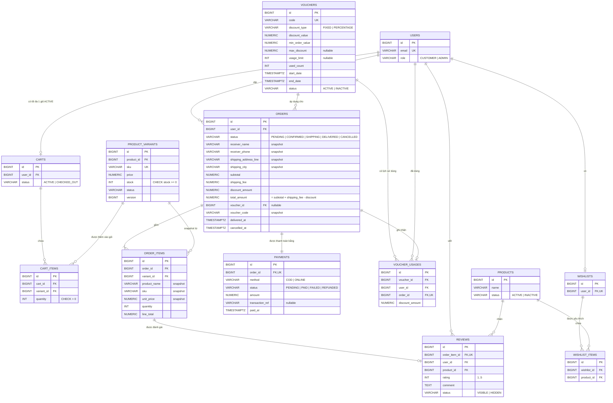

# ERD nhóm Cart / Order / Voucher / Review (D06)

Phạm vi: Cart, Checkout, Order, Payment, Voucher, Review, Wishlist.
Các bảng `users`, `products`, `product_variants` đã có từ migration V2–V3 (Account + Catalog), ở đây chỉ vẽ các cột cần cho quan hệ.

Migration tương ứng: `V5__cart_schema.sql`, `V6__voucher_schema.sql`, `V7__order_payment_schema.sql`, `V8__review_schema.sql`, `V9__wishlist_schema.sql`.

> Ghi chú: kiểu tiền là `NUMERIC(14,2)` (VND), thời gian là `TIMESTAMPTZ`. Trong sơ đồ chỉ ghi `NUMERIC` cho gọn.

## 1. Sơ đồ ERD

## 2. Ràng buộc quan trọng ở mức database

| Ràng buộc | Mục đích |
|---|---|
| `UNIQUE INDEX carts(user_id) WHERE status='ACTIVE'` | Mỗi Customer chỉ có một giỏ ACTIVE (C03) |
| `UNIQUE (cart_id, variant_id)` | Một variant chỉ xuất hiện một lần trong giỏ (C04) |
| `vouchers.code UNIQUE` | Mã voucher không trùng (V04) |
| `CHECK (start_date < end_date)` | Ngày bắt đầu phải nhỏ hơn ngày kết thúc (V05) |
| `CHECK (used_count <= usage_limit)` | Không vượt giới hạn lượt dùng kể cả khi nhiều đơn cùng lúc (V08) |
| `CHECK (total_amount = subtotal + shipping_fee - discount_amount)` | Tổng tiền đơn luôn nhất quán (O12) |
| `CHECK (discount_amount <= subtotal)` | Giảm giá không vượt tiền hàng |
| `CHECK (line_total = unit_price * quantity)` | Thành tiền từng dòng nhất quán |
| `UNIQUE (voucher_id, user_id)` trên `voucher_usages` | Mỗi khách dùng mỗi mã một lần |
| `UNIQUE (order_item_id)` trên `reviews` | Mỗi OrderItem chỉ được review một lần (R05) |
| `CHECK (rating BETWEEN 1 AND 5)` | Điểm đánh giá hợp lệ (R04) |
| `product_variants.stock >= 0` (từ V3) | Không bao giờ để tồn kho âm |

## 3. Quy tắc nghiệp vụ (business rules)

### Giỏ hàng
- Chỉ thêm được variant `ACTIVE` thuộc product `ACTIVE`, category và brand `ACTIVE`.
- Số lượng phải > 0 và không vượt tồn kho hiện tại.
- Thêm một variant đã có trong giỏ thì cộng dồn số lượng.
- Giỏ tính `subtotal` ở backend, không tin giá do client gửi.

### Checkout / tạo đơn
- Địa chỉ giao hàng phải thuộc Customer đang đăng nhập.
- Backend tính lại toàn bộ: `subtotal` → `shipping_fee` → `discount` → `total`.
- Phí ship: 30.000 VND, miễn phí khi `subtotal` từ 500.000 VND trở lên.
- Tạo đơn chạy trong một transaction: kiểm tra tồn kho lần cuối, trừ tồn kho, snapshot tên/SKU/đơn giá/địa chỉ, ghi nhận voucher, xóa giỏ. Lỗi ở bất kỳ bước nào thì rollback toàn bộ.

### Voucher
- Mỗi đơn dùng tối đa 1 mã; mã được chuẩn hóa chữ hoa.
- Hợp lệ khi: `ACTIVE`, đang trong khoảng `start_date`–`end_date`, `subtotal >= min_order_value`, `used_count < usage_limit` (nếu có giới hạn), khách chưa dùng mã này.
- `FIXED`: giảm đúng `discount_value`. `PERCENTAGE`: giảm `subtotal × discount_value / 100`, không vượt `max_discount` (nếu có).
- Giảm giá không bao giờ vượt `subtotal`.
- Hủy đơn thì hoàn lại lượt dùng voucher.

### Vòng đời đơn hàng

| Từ | Sang | Ai thực hiện |
|---|---|---|
| PENDING | CONFIRMED | Admin |
| CONFIRMED | SHIPPING | Admin |
| SHIPPING | DELIVERED | Admin |
| PENDING | CANCELLED | Customer hoặc Admin |
| CONFIRMED | CANCELLED | Customer hoặc Admin |

- Không cho Customer hủy đơn đang `SHIPPING` hoặc `DELIVERED`; mọi chuyển trạng thái khác đều bị từ chối.
- Hủy đơn thì hoàn tồn kho và hoàn lượt dùng voucher.
- Khi chuyển sang `DELIVERED` thì ghi `delivered_at`; thanh toán COD tự chuyển `PAID`.

### Thanh toán
- CORE: COD. Đơn mới có `payment.status = PENDING`, khi giao thành công chuyển sang `PAID`.
- BONUS: thanh toán online (mô phỏng cổng thanh toán).

### Review
- Chỉ review khi đơn chứa OrderItem đó ở trạng thái `DELIVERED` và là đơn của chính khách.
- `rating` từ 1 đến 5, mỗi OrderItem chỉ review một lần.
- Admin có thể ẩn/hiện review; chỉ review `VISIBLE` mới được liệt kê công khai và tính vào điểm trung bình.

### Dashboard
- Doanh thu chỉ tính các đơn `DELIVERED`.
